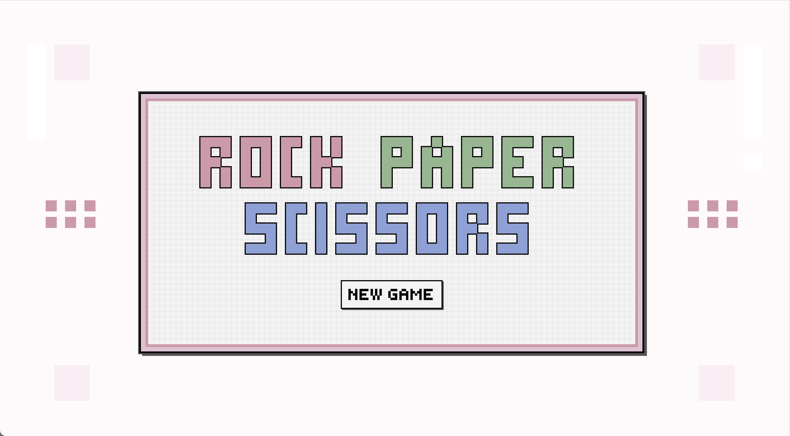
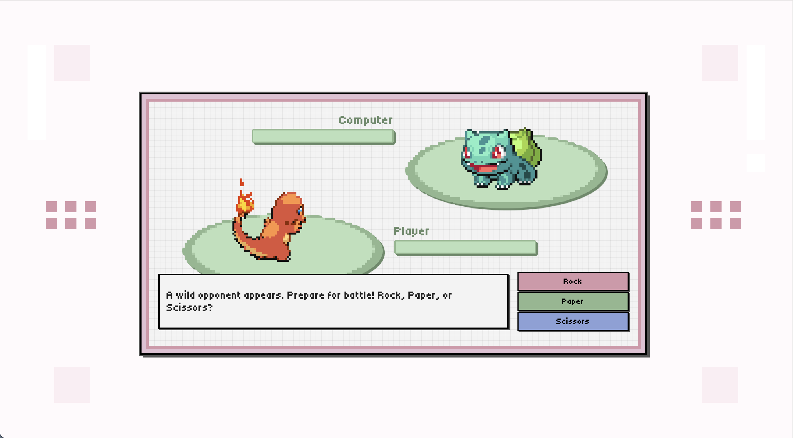

# 🎮 Retro Rock-Paper-Scissors

A browser-based **Rock–Paper–Scissors** game built with **HTML, CSS, and JavaScript**. 

Originally developed as part of [The Odin Project Foundations](https://www.theodinproject.com/paths/foundations/courses/foundations) curriculum, this version is enhanced with a retro pixel-inspired UI with health bars, dialogue boxes, and animations. 

## Features

- **Classic gameplay**: Player vs. Computer Rock–Paper–Scissors.  
- **HP system**: Health bars decrease when you lose a round.  
- **Dialogue box**: Randomized messages with a typewriter effect.  
- **Pixel-style UI**: Shadows, retro borders, and simple sprite-based visuals.  

## Preview

## Live Demo
Play the game [here](https://charmbun.github.io/rock-paper-scissors/).

## License
This project is for educational purposes only.
All referenced names and image inspirations are used for non-commercial purposes.